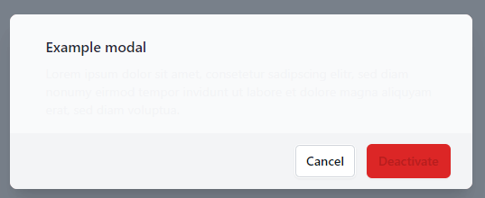

# axe/playwright inconsistent color contrast bug

Short reproduction to show the inconsistent color-contrast violation detection.

## How to use

Clone the repo

```bash copy
git clone git@github.com:DerTimonius/axe-playwright-bug-reproduction.git
```

Install the dependencies

```bash copy
yarn
```

Start the server (runs on port 5173)

```bash copy
yarn dev
```

Run the test

```bash copy
yarn playwright test
```

## What

The following image shows two contrast issues, but the test only detects one (in the red button), the contrast of almost 1:1 is not detected.

